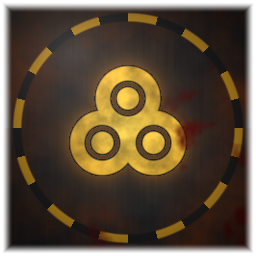

# DEAD SECTOR

A **3D zombie shooter built entirely from scratch** — every texture, model, animation,
sound effect and level is **generated procedurally at runtime from code**.
There is not a single image file, model file (`.gltf`/`.fbx`/`.obj`) or audio file
anywhere in this repository.



## Controls

| Input | Action |
|---|---|
| `W` `A` `S` `D` | Move |
| **Mouse** | Look / rotate view |
| **Left click** | Fire |
| **Right click** | Aim down sights (ADS) |
| `Shift` | Sprint |
| `Ctrl` / `C` | Crouch |
| `Space` | Jump |
| `R` | Reload |
| `1`–`5` / Wheel | Switch weapon |
| `E` | Interact / pick up |
| `V` | Melee |
| `G` | Throw grenade |
| `F` | Flashlight |
| `Esc` | Menu / pause |
| `F11` | Fullscreen |

## Features

### Everything is 3D, nothing is a bare cube or plane
* **Walls** are real wall models — individually laid, chipped, settled bricks with
  coping stones, rubble skirts and damage cavities.
* **Ground** is a noise-displaced terrain mesh with cambered road slabs, extruded
  chamfered kerbstones, individually settled flagstones, lathed manhole castings
  and storm-drain grates.
* Buildings, fire escapes, HVAC units, water tanks, wrecked cars, barrels, crates,
  sandbag emplacements, dumpsters, street lamps, fences, jersey barriers, dead
  trees, rubble piles — all built from bevelled solids, lathed profiles, extruded
  outlines, swept tubes and noise-displaced organics.

### Procedural PBR texturing
A GPU texture baker renders hand-written GLSL recipes into full
**albedo + normal + roughness/metal/AO** sets at load time. 19 surface recipes
(brick, concrete, asphalt, dirt, wood, rust, painted metal, zombie skin, rags,
blood, tile, gunmetal, polymer, cracked glass, hazard stripes, sandbag, leather,
bone, foliage) drive ~45 materials. Normals are derived analytically from the
height function; AO is baked into the albedo alpha channel.

### Weapons — 5 fully modelled firearms
`MK-7 CARBINE` · `BREAKER 12G` · `P-9 SIDEARM` · `VECTOR-9` · `LONGSHOT .338`
plus a fragmentation grenade and gloved viewmodel arms. Rendered through a
separate viewmodel camera so the weapon never clips into world geometry.

### Zombies — 5 types with full skeletons
`WALKER` · `RUNNER` · `BRUTE` · `CRAWLER` · `BLOATER`
Procedurally modelled anatomy with a 20-joint hierarchy, 12 hit zones
(head multiplier ×3), limb dismemberment, and head gibbing.

### Ragdoll physics
Deaths hand over to a custom **Verlet ragdoll solver** (particles, distance and
range constraints, self-collision, world collision, sleeping). The same solver
drives gibs, shell casings, debris chips and thrown grenades.

### Gore & persistent blood
Instanced blood decals conform to surface normals and **persist on the ground for
the entire match — they never fade**. Pools grow under corpses, arterial geysers
attach to severed joints, and a GPU particle system (single instanced buffer,
6 particle types, velocity stretching) handles spray, mist and chunks.

### 100% procedural audio
Gunshots, zombie growls (2-pole IIR formant resonator banks), impacts, gore,
footsteps, UI and ambience are synthesised into buffers at load time. HRTF
panning, distance lowpass, and a procedurally generated convolution reverb.

### Rendering
WebGL2 · HDR · ACES tonemapping · PCF soft shadows · SAO ambient occlusion ·
UnrealBloom · custom colour-grade pass (film grain, chromatic aberration,
vignette, lift/gain/contrast/saturation, damage pulse) · SMAA · procedural
sky shader captured to a PMREM environment map for IBL.

### Game systems
Full menu suite (main, pause, settings with 4 tabs, arsenal & enemy intel,
about, wave intermission, game over, loading), a wave director with
composition-based spawn queues, weapon unlocks, pickups, score/streak system,
3 difficulty levels, and persistent settings + best-wave record.

## Building

```bash
npm install
npm run build:bundle     # bundle src/ -> public/bundle.js
npm run serve            # play in a browser at http://localhost:3000
npm start                # play in the Electron desktop shell
npm run build:exe        # produce build/DeadSector.exe (single portable file)
```

## Project layout

```
src/
  main.js                entry point
  Game.js                orchestrator: boot, state machine, wave director, loop
  core/
    Renderer.js          HDR renderer + post-processing chain + procedural sky
    physics.js           OBB colliders, spatial hash, capsule solver, Verlet
    Input.js             pointer lock, rebindable actions
    Audio.js             procedural Web Audio synthesis engine
  gfx/
    noise.js             CPU PRNG / value noise / fbm / worley
    glsl-noise.js        GPU noise library (shader source)
    TextureBaker.js      GPU PBR texture baker with ORM packing
    recipes.js           19 GLSL surface recipes
    geometry.js          procedural geometry toolkit
    Materials.js         material library
  entities/
    weapons.js           5 firearms + grenade + viewmodel arms
    zombieModel.js       procedural zombie anatomy
    Zombie.js            AI, animation, hit zones, dismemberment, ragdoll
    Player.js            FPS controller, ballistics, viewmodel animation
  fx/Effects.js          particles, blood decals, muzzle flash, tracers, gibs
  world/
    props.js             prop & architecture library
    Level.js             urban level generator
  ui/
    HUD.js               combat interface
    Menu.js              all menu screens
tools/
  build.mjs              esbuild bundler
  serve.mjs              dev static server
  make-icon.mjs          procedural icon generator (PNG + ICO)
  package-win.mjs        single portable Windows .exe packager
electron/main.cjs        desktop shell
```

## License

MIT © mmdrezaazadi
